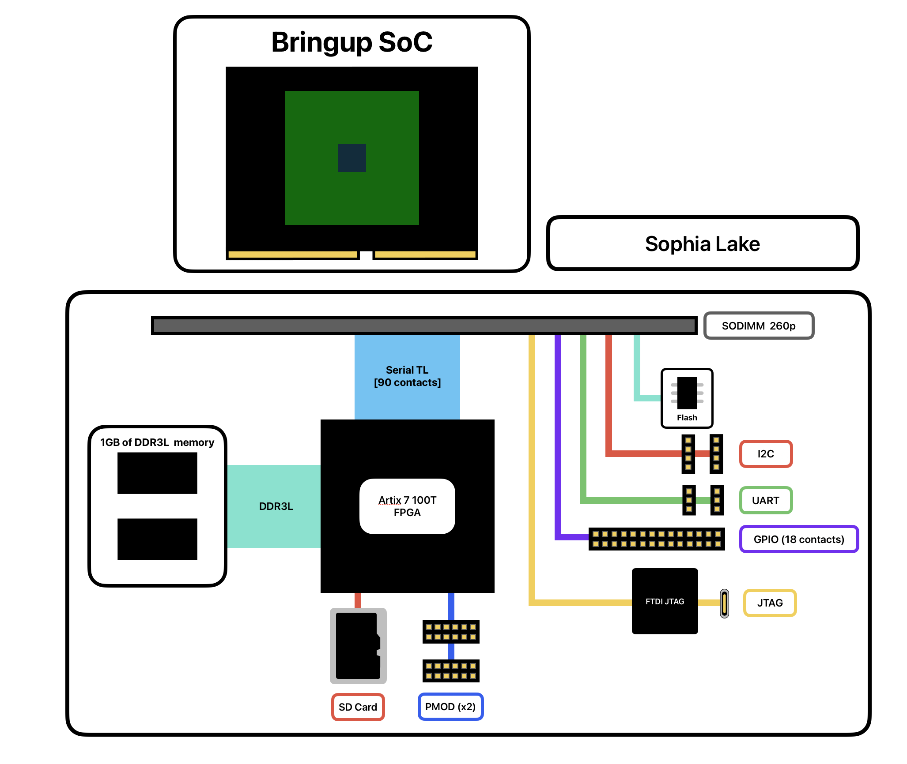
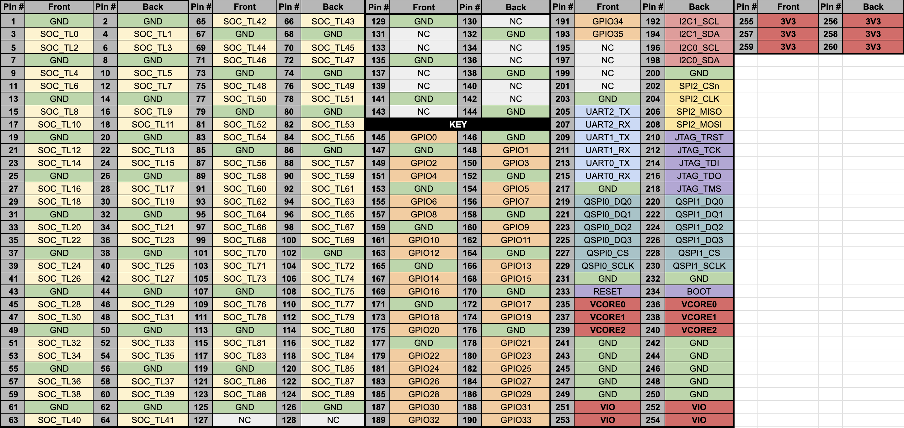
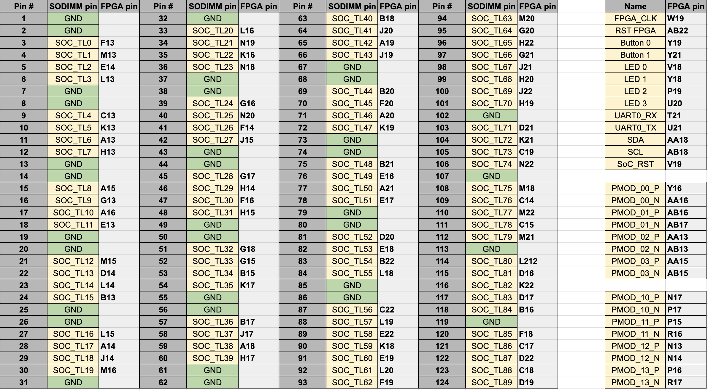
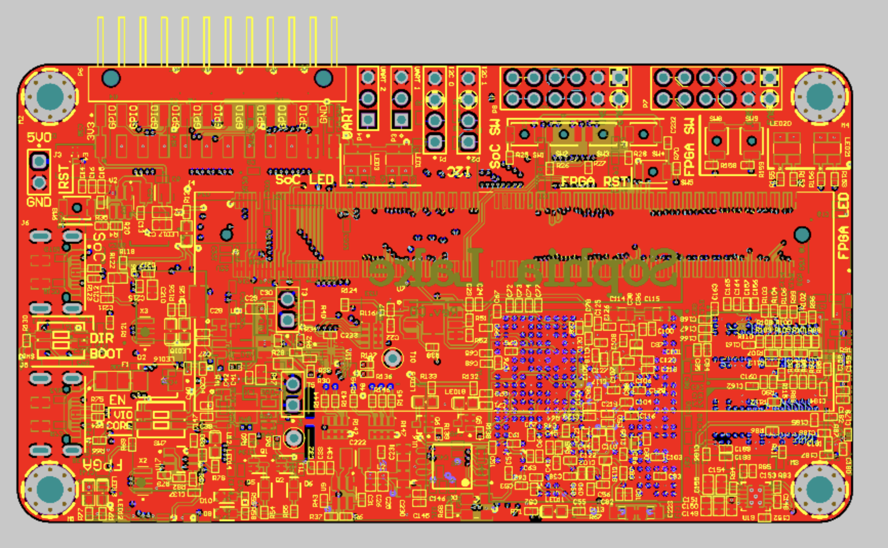
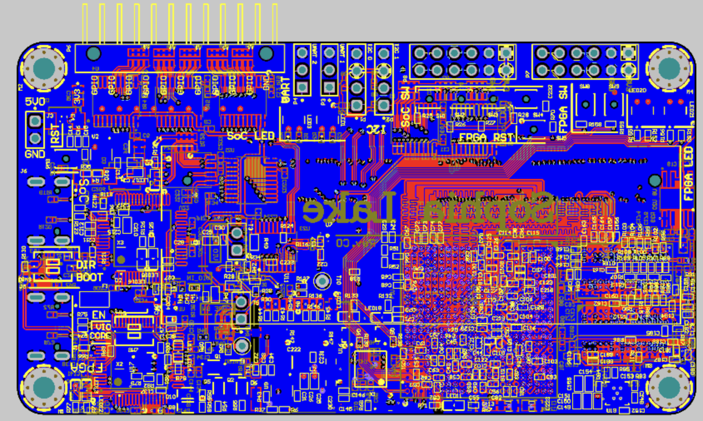

# **SOPHIA LAKE**

# Introduction

Sophia Lake is a general-purpose bring-up carrier board optimized for portability. It is designed around the Bora Lake SODIMM interface to allow for compatibility with a wide array of custom SoCs.

****

Art by: [@seuiwu](https://www.instagram.com/seuiwu?utm_source=ig_web_button_share_sheet&igsh=ZDNlZDc0MzIxNw==)

# Block Diagram

> *"Yufeng's hair style looks like Si-en"*\
>   \- Sophia Shao 

# Specs
### On-board FPGA
|                | Artix A7 100T     | Artix A7 200T     |
| -----------    | -----------       | -----------       |
| FPGA part      | XC7A100T-2FBG484I | XC7A200T-2FBG484I |
| Logic Cells    | 101,440           | 215,360           |
| DSP Slices     | 240               | 740               | 
| Memory (Kbits) | 4,860             | 13,140            | 

### FPGA Features
- 1GB DDR3L DRAM with 32-bit bus @ 400MHz (800 MT/s)
- 16MB Quad-SPI Flash
- USB-JTAG programming
- MicroSD card slot
- 2x PMOD headers
- 1x Reset button
- 2x Programmable buttons
- 4x LEDs

### SoC Breakout
- 16MB Quad-SPI Flash
- USB-JTAG programming
- Boot select and variable polarity chip reset
- Built-in level shifting to 3.3V
- 4x Programmable buttons
- 4x LEDs
- 2x UART 
- 2x I2C
- 18x GPIO pins

### SoC Power Injection
- Programmable Soc power input
    - VIO input from 1.2V - 3.3V
    - VCORE input from 0.8V - 2.0V
- Optional external power injection
- Shunt resistors for current sensing

# SODIMM Pinout

# Sophia Lake Pinout

# Board Layout

